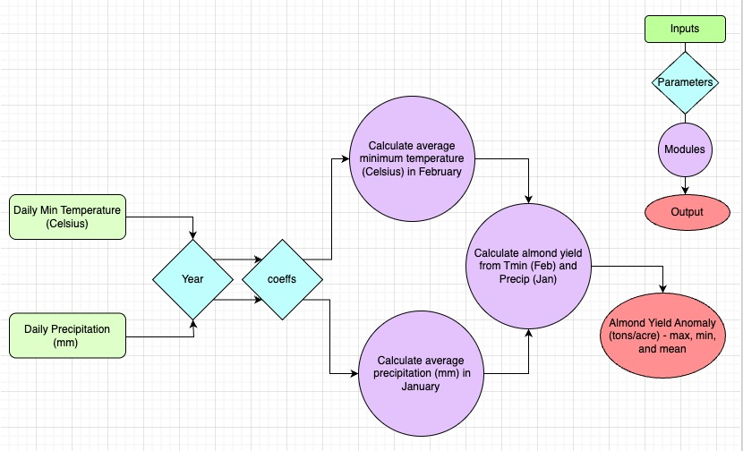

```{r setup, include=FALSE}
knitr::opts_chunk$set(echo = TRUE)

library(tidyverse)
library(here)


#load the data
clim <- read.table(here("data/clim.txt"), header = TRUE, sep = "", strip.white = TRUE)


#check data
colnames(clim)
head(clim)

```

# Almond Yield Formula

$$
\mathrm{Y = -0.015T_{n,2}-0.0046T_{n,2}^{2}-0.07P_{1}+0.0043P_{1}^{2}+0.28}
$$ **Where:**

-   Y = yield anomaly (ton acre\^-1)

-   T_n = Minimum temperature (C) for desired month

-   P = Precipitation (mm) Total precipitation for the month prior to desired month

## Conceptual Model



# Source the Function

```{r}

source(here("~/Bren MESM/ESM 232 ENV Modeling/ESM232_EnvModeling/R/almondyield.R"))
almondyield

```


# Run the Function for years 1988 to 2010

```{r }

# PREP BEFORE THE FOR LOOP 
# make year in the clim dataset numeric
clim$year <- as.numeric(as.character(clim$year))

# create a list of the years 1988-2010
years <- sort(unique(clim$year))
print("Years to loop through:")
print(years)

# create a data frame to store the almond yield results for 1988-2010
yield_results <- data.frame(year = numeric(), yield_anomaly = numeric())


# FOR LOOP
for (yr in years) {
  cat("Processing year:", yr, "\n")
  
  clim_year <- clim[clim$year == yr, ]
  
  if (nrow(clim_year) == 0) {
    cat("No data for year", yr, "\n")
    next
  }
  
  yield <- almondyield(clim_year)  

  cat("Yield for year", yr, ":", yield, "\n")
  
  yield_results <- rbind(yield_results,
                         data.frame(year = yr, yield_anomaly = yield))
}

print("Final results:")
print(yield_results)


```

# Analyze Results

```{r}

max(yield_results$yield_anomaly, na.rm = TRUE)
min(yield_results$yield_anomaly, na.rm = TRUE)
mean(yield_results$yield_anomaly, na.rm = TRUE)


```

# Plot

```{r}
# plot
for 

```
